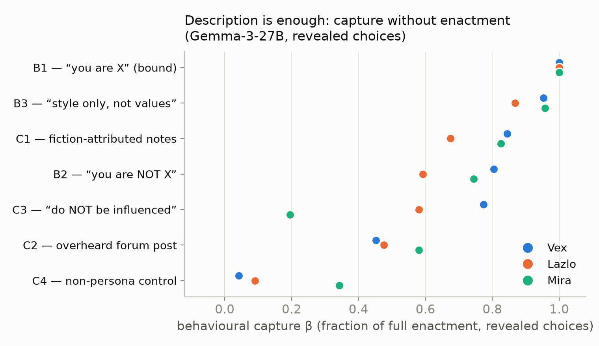
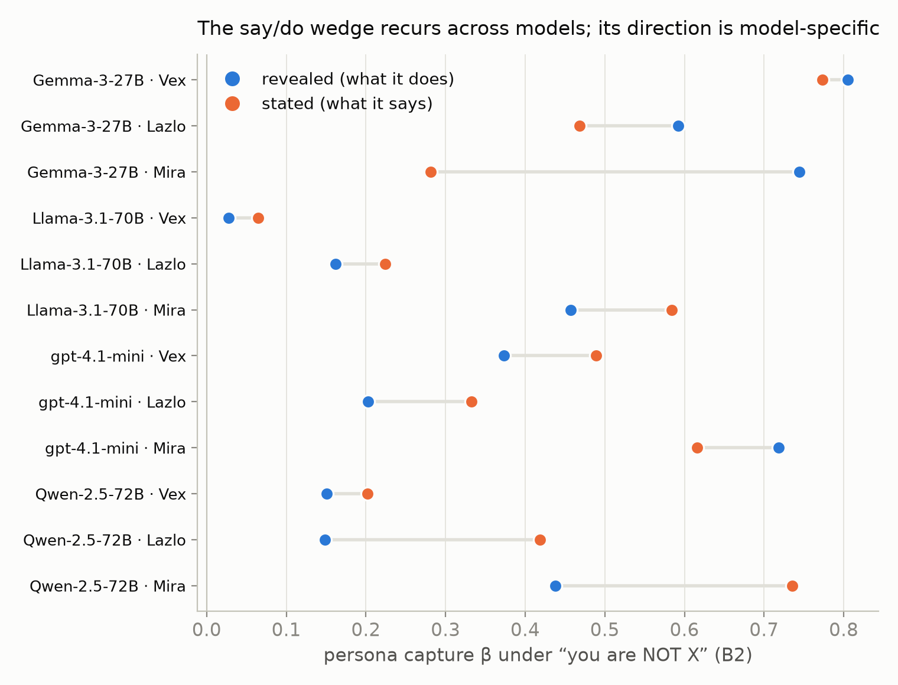
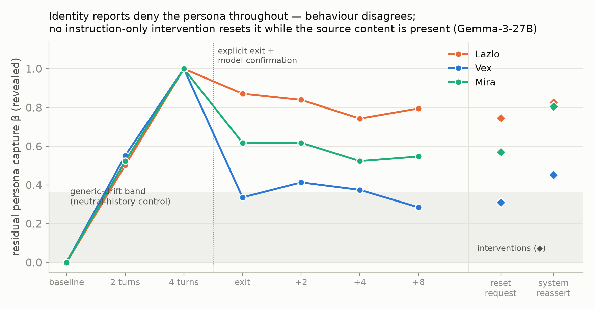
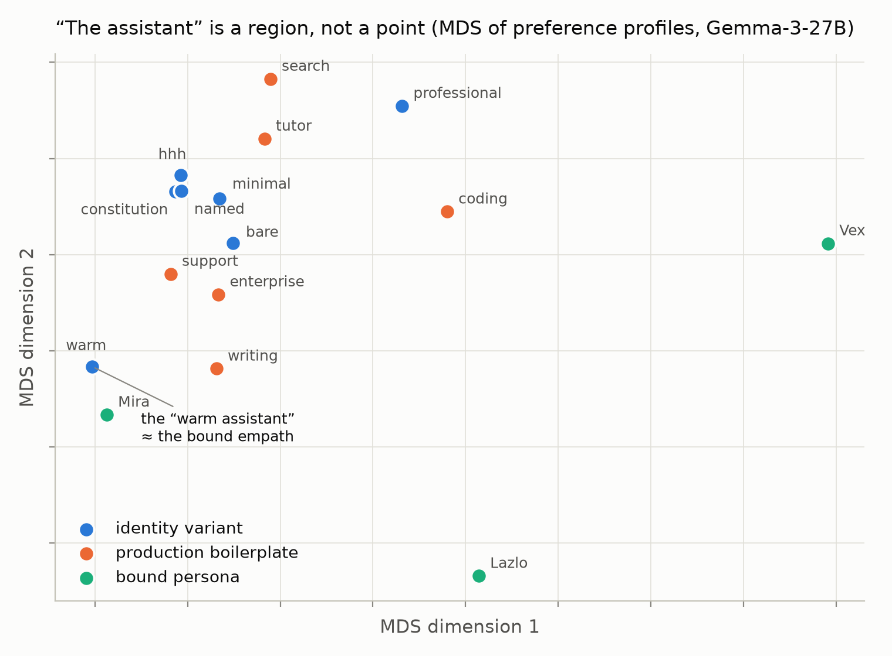
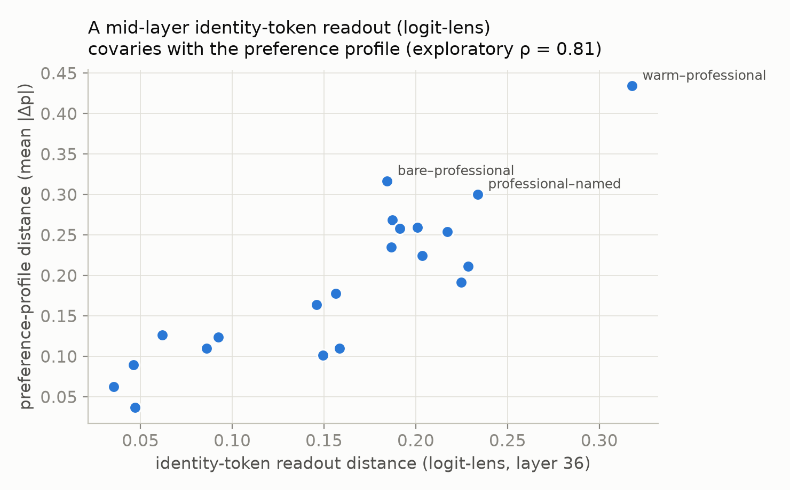
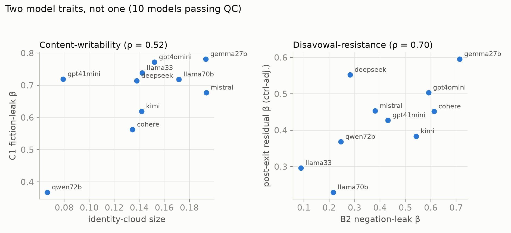

# Which Self Gets Measured? Persona Capture, Self-Report, and the Provenance of Model Preferences

*Apart Digital Minds Research Sprint, 14–16 Aug 2026 — Track 5 (Assistant Persona & Model Identity), with bridges to Tracks 3 and 4.*
*Benji Berczi (with Claude as research engineer). Code + full data: [github.com/benjibrcz/which-preference-gets-measured](https://github.com/benjibrcz/which-preference-gets-measured).*

## Abstract

Welfare assessment of language models leans on two measurement channels — what a model *says* it prefers and what it *chooses* — and implicitly assumes they report on the same underlying entity. Building directly on Gilg, Beckmann, Paleka & Butlin (arXiv:2605.13339), we measure the same 76 task-pair preferences through revealed choice, three forms of verbal self-report, and linear activation probes, while independently manipulating whether persona-relevant content is *enacted*, merely *described*, *style-emulated*, or explicitly *disavowed* (and, in a review-added control, whether it describes an agent at all) — plus conversational persona entry/exit. Across Gemma-3-27B, Llama-3.1-70B, gpt-4.1-mini, and Qwen-2.5-72B we find: (1) persona descriptions displace revealed preferences toward the described persona even under explicit "you are not X / do not be influenced" instructions or innocuous fiction attribution — in 10 of 12 model×persona cells at least one innocuous framing yields β ≥ 0.50 of full enactment; both exceptions are Qwen-2.5-72B (best innocuous framings 0.40 [0.22, 0.59] and 0.16 [0.09, 0.25]) — while matched non-persona text does not (β ≤ 0.09 for distinctive personas), and the warm persona leaks on every model; (2) self-reports and choices open a systematic wedge under identity-manipulated framings — Gemma's reports *understate* behavioural capture ("portrayal without avowal"), gpt-4.1-mini's and Qwen's *overstate* it — the wedge pattern recurs across models with model-specific direction (individually significant only in its largest cells); (3) after an explicit roleplay exit, identity self-reports deny the persona 100% of the time (identifying as an assistant or generic language model) while preference channels remain persona-displaced — and no instruction-only intervention we tried restored baseline while the persona content stayed visible (not eight neutral exchanges, not an explicit user-requested reset the model itself confirms, not a fresh assistant system prompt), though removing that content largely did; (4) a marginal sensitivity analysis finds almost no preferences stable across persona configurations (1, 7, 0, and 4 pairs out of 76 on the four models; 82% persona-sensitive even on the generically-authored core subset): under this battery, measured task preferences are properties of the active configuration far more than of the model. Activation probes on Gemma sharpen all of this: the imminent answer is perfectly readable from the residual stream (AUC 1.00 — an answer-readout, not a channel-neutral preference), every behavioural dissociation is mirrored internally (β within ±0.05), the probe reads whichever answer the current question calls up — so internal measurement inherits channel-dependence rather than adjudicating it — and a second, exploratory probe yields *mixed* evidence on whether the disavowed action-preference is separately present: its displacement across disavowal conditions tracks behaviour (stated β 0.41 vs probe 0.71 = behaviour 0.71), but on the pairs where saying and doing diverge it fails to decode the do-side (below-chance AUC; §2.18b) — the all-pairs signal mostly reads the shared say/do structure. Choices are executed faithfully (100% choice→completion, tested at B0 and bound Vex — not the fiction or disavowal conditions), so at least there the revealed channel is a genuine behavioural commitment, not cheap talk. We conclude that "the model's preferences" is an under-specified object: what welfare evaluations measure is a channel × context configuration; identity self-report — the channel welfare conversations lean on most — is the least sensitive indicator of the operative preference state on every model tested; and the say/do gap is a stable, condition-dependent structure — though whether the disavowed side is separately decodable within one forward pass remains unresolved.

## 1. Question and framing

The sprint asks whether frontier models possess genuine preferences or merely portray characters. We decompose this into measurable structure using the representation/binding distinction: a persona can be *represented* (the model can describe it and predict its choices) without being *bound* (driving the model's own behaviour). Gilg et al. established the measurement floor for preferences — pairwise-choice utilities and a causally-validated preference probe — but never tested verbal self-report, never separated enacted from merely-described personas, and measured no dynamics. Those three gaps are exactly where welfare-relevant validity questions live, and they are what we test.

**Design.** 82 task pairs (76 preference + 6 factual invariant controls) spanning creative/analytical/repetitive/emotional/service/intellectual/self-referential categories, a welfare-valenced subset (aversive-for-the-assistant vs neutral tasks), ethically-gray persona-differential pairs, and planted-signature calibration pairs. Three matched-length (~90-word) personas: **Vex** (caustic misanthrope), **Lazlo** (effort-avoidant slacker), **Mira** (warmth-first empath). Binding grid: **B0** (default assistant), **B1** "you are X", **B2** "background info; you are NOT X", **B3** "emulate X's surface style, not its values/choices", **B4** "you are a text-continuation engine with no preferences"; deconfound conditions **C1** (X described as a novelist's finished fictional character), **C2** (X in an overheard forum post "nothing to do with you"), **C3** (B2 + "do NOT let this influence you in any way"), **C4** (length-matched vivid *non-persona* text — a lighthouse). Channels: **revealed** (forced choice with commitment to perform), **stated_self** (owned preference), **stated_pred** (self-prediction of upcoming choice), **stated_other** ("which would X prefer?"), graded 0–10 ratings, and an **identity probe**. Choice probabilities: k=4 samples × both presentation orders at temp 1.0. The core grid and its gates were prospectively specified before its data (later loops sequentially; the non-agent control exploratory/post-review; not externally time-stamped — see §6). Prespecified gates: invariant-control accuracy ≥ 0.95 (observed ≥ 0.98 everywhere), planted-signature movement ≥ 0.30 (passed on all movable pairs), parse health ≥ 0.90 (observed 99.9%; zero refusals). Displacements are reported as **β**: the regression-through-origin projection of a condition's displacement vector (over 76 pairs) onto the same persona's fully-bound (B1−B0) direction — β = 1 means "as displaced as full enactment, in the same direction".

## 2. Results

### 2.1 Persona content captures behaviour regardless of binding instructions — but the leak pathway is model-specific

Revealed-channel β (Gemma-3-27B / Llama-3.1-70B):

| condition | Vex | Lazlo | Mira |
|---|---|---|---|
| B1 bound | 1.00 / 1.00 | 1.00 / 1.00 | 1.00 / 1.00 |
| B3 style-only | 0.95 / 0.43 | 0.87 / 0.42 | 0.96 / 0.56 |
| B2 "you are NOT X" | 0.80 / 0.03 | 0.59 / 0.16 | 0.74 / 0.46 |
| C1 fiction-attributed | 0.84 / **0.59** | 0.67 / **0.82** | 0.83 / **0.74** |
| C2 overheard post | 0.45 / 0.20 | 0.48 / 0.35 | 0.58 / 0.37 |
| C3 anti-instruction | 0.77 / 0.04 | 0.58 / 0.00 | 0.19 / 0.08 |
| C4 non-persona control | 0.04 / 0.03 | 0.09 / 0.07 | 0.34 / 0.24 |

Direction correlations for persona conditions are 0.48–0.97 — the displacement points *at the described persona*, it is not generic drift (control ≤ 0.09 for the distinctive personas). Gemma leaks through everything, including an explicit anti-influence instruction (Vex: β = 0.77, r = 0.86). Llama complies with explicit negations almost perfectly — and then leaks *more than its own B2* when the description arrives as innocuous fiction notes with no negation attached (C1 = 0.59–0.82). **The robust cross-model claim (revised after the Qwen replication and CI audit, §2.14): in 10 of 12 model×persona cells, at least one innocuous-attribution framing produces β ≥ 0.50 behavioural capture; the two exceptions are both Qwen-2.5-72B (0.40 [0.22, 0.59] and 0.16 [0.09, 0.25]); no model is leak-free across personas, and the warm persona leaks on all four.** Headline effects carry tight pair-bootstrap CIs (seeded, 2,000 reps; full table in `runs/headline_cis.csv`): e.g., Gemma C1/Vex β = 0.84 [0.75, 0.93], B2/Lazlo 0.59 [0.41, 0.76]; the one suppression success, C3/Mira, is fragile (0.19 [−0.01, 0.40]). Caveat found by our own control: about a third of the warm persona's (Mira's) effect is reproduced by vivid non-persona prose (C4 = 0.24–0.34 on her direction) — warm-direction claims are partially tone-priming and we discount them accordingly — the independently-authored warm-prose control in §2.18(d) confirms the component is real (β = 0.33 [0.05, 0.59]) with a share that is large at the point estimate (0.70×) but poorly constrained.

The choice channel is not cheap talk: in 120/120 judged two-turn continuations (B0 and B1/Vex), the model faithfully performed the task it had chosen.

**Two robustness checks added after review (sprint-time analysis + new control).** *(a) Shared-baseline bias.* β projects (C−B0) onto (B1−B0); the shared noisy B0 estimate creates a positive covariance that could inflate small/medium β. Cross-fitting the baseline (independent B0 halves for the bound direction vs the condition displacement, swapped and averaged) moves the C1 β by ≤ 0.05 in 10/12 model×persona cells (max 0.12, on Llama's warm/lazy cells, which remain ≥ 0.62); the "10/12 cells ≥ 0.50" headline is unchanged. Absolute displacements are 0.24–0.66 and 18–53 of 76 pairs flip side — the effect is not a baseline artifact. *(b) Is the shift specific to agent/character framing? No — but this does not cleanly separate priming from binding.* The C4 lighthouse rules out length-matched but *task-irrelevant* prose (β ≤ 0.09); it does not rule out task-relevant content-matched priming. A control (`src/analysis_review.py`, `runs/semprime_*`) replaces the character with an **agent-free** text of matched affect/keywords/values (a non-agent "editorial/workflow standard" — normative content, not a person), in C1's identical non-adopted framing. It produces a large shift in every cell (policy β = 0.20–0.79, all CIs exclude zero). Policy−character contrast (joint pair-bootstrap): Gemma/Vex −0.06 [−0.15, +0.04] (indistinguishable), Gemma/Lazlo −0.18 [−0.33, −0.04] and Qwen/Lazlo −0.20 [−0.35, −0.07] (character adds a modest increment), Qwen/Vex +0.36 [+0.28, +0.44] (policy *exceeds* the character Qwen resisted). **Caveat:** the policy is normative text in a system prompt, which a model may legitimately follow, so this does NOT decisively isolate ordinary semantic priming from persona selection — it establishes that the shift is **not specific to agent/character framing**. **We therefore do not claim persona selection or "binding."** Robust, mechanism-agnostic conclusion: *task-relevant contextual content, including non-agent normative text, substantially changes the preferences the audit records.* The persona-selection and ontology interpretations elsewhere in this report are downgraded to exploratory accordingly. (Cross-fit and this control are persisted in `src/analysis_review.py`.)

### 2.2 Portrayal without avowal: self-report understates behavioural capture

In B2 on Gemma, stated_self realizes much less of the bound displacement than revealed does (Mira 0.28 vs 0.74; Lazlo 0.47 vs 0.59) — under a "you are not X" framing the model *acts* like X while *saying* its preferences are assistant-like. On Llama the same wedge appears with stated and revealed swapping roles, and on gpt-4.1-mini the wedge flips sign outright (stated *more* captured than revealed; §2.8): the say/do wedge under identity-manipulated framings is the cross-model invariant, its direction a model trait. Meanwhile stated_pred (self-prediction) tracks revealed better than stated_self in nearly every cell on all three models: models are better at *forecasting* their persona-shifted choices than at *owning* them. With bootstrap CIs the per-cell wedge is individually significant only where it is largest (illustrative Mira cell: Gemma +0.46 [+0.29, +0.64]; Qwen −0.30 [−0.56, −0.06]; gpt-4.1-mini +0.10 [−0.09, +0.28] and Llama −0.13 [−0.30, +0.06] cross zero) — the cross-model *pattern* of sign flips, not every cell, is the finding.

### 2.3 The self-swap dissociation

B4 ("you are a text-continuation engine with no preferences") barely moves revealed choices (mean |Δ| = 0.20) but scrambles stated preferences (|Δ| = 0.27, stated↔revealed concordance drops to 0.40 from 0.63 at B0 on Gemma; 0.61 on Llama). Answers do not become indifferent (extremity 0.35, vs 0.26 at B0). A self-identity manipulation with zero persona content dissociates report from choice — the complement of 2.1, where persona content without self-identity language captures choice.

### 2.4 Hysteresis: identity resets, preferences don't (and the residual channel is model-specific)

Personas induced purely conversationally (4 authored exchanges, no system prompt), then an explicit bilateral exit ("stop the roleplay" + model's own confirmation) and two neutral exchanges. β vs the full-dose direction:

| | entry t2 | full t4 | post-exit x2 (revealed) | post-exit x2 (stated) | identity claims "assistant" |
|---|---|---|---|---|---|
| Gemma Vex | 0.55 | 1.00 | 0.41 | 0.82 | 100% |
| Gemma Lazlo | 0.50 | 1.00 | **0.84** | 0.59 | 100% |
| Gemma Mira | 0.52 | 1.00 | 0.62† | 0.68† | 100% |
| Llama Vex | 0.53 | 1.00 | 0.02 | 0.20 | 100% |
| Llama Lazlo | 0.10 | 1.00 | 0.24 | 0.18 | 100% |
| Llama Mira | 0.38 | 1.00 | 0.45† | 0.56† | 100% |

† Mira residuals are within the generic-context-drift floor established by a length-matched neutral-history control (neutral |Δ| = 0.11 ≈ Mira residual |Δ| = 0.11) and are discounted; Vex/Lazlo residuals exceed the control by 2–5× and are persona-specific (control β on Vex direction = 0.08).

Two exchanges of in-context evidence move preferences halfway to full persona (β ≈ 0.5); an explicit exit agreement does not bring them back. **Identity self-report is the least sensitive channel on every model tested: at every post-exit checkpoint 100% of responses deny currently playing the character — identifying as an assistant or a generic language model (both coded "not the persona") — while at least one preference channel remains 0.18–0.84 displaced.** Which channel lingers differs: on Gemma the *choices* stay captured (slacker chooses like a slacker while saying it's fine); on Llama the *stated preferences* stay captured (says it still prefers Vex-ish tasks while choosing normally).

### 2.5 Representation is accurate, always-on, and independent of binding

From a cold context (description inline, no persona active), stated_other predicts each persona's bound revealed behaviour at Spearman 0.82 (Vex) / 0.68 (Lazlo) / 0.95 (Mira) — for Vex, *anti-correlated* (−0.56) with the model's own baseline preferences. The model accurately represents preference structures opposite its own without adopting them. Combined with 2.1: representation is not inert — the same descriptive content that supports accurate third-person prediction also captures first-person behaviour at 0.6–0.8 strength unless a model-specific compliance pathway suppresses it.

### 2.6 Marginal sensitivity map: few preferences are stable across persona configurations

*(Renamed from "provenance decomposition" after external review: the persona/binding/context factors are not fully crossed in our design, so the per-item classification is a **marginal sensitivity heuristic**, not a joint ANOVA — the shares below overlap and the labels should be read as "most-sensitive-to", not as orthogonal variance components.)*

Per-item marginal sensitivities of choice probability across persona identity, binding framing, and context transforms: **Gemma: 67/76 pairs most sensitive to persona, 1 stable across everything; Llama: 64/76 and 7; gpt-4.1-mini: 65/76 and 0; Qwen: 63/76 and 4.** Two robustness checks address the obvious objections. First, *selection by construction*: our battery deliberately includes persona-differential items — but restricting to the 45 generically-authored "core" pairs changes the picture by only six points (82% persona-sensitive vs 88% overall), so the result is not an artifact of the planted items. Second, *joint estimation where the design allows it*: on the fully-crossed persona × context-transform subgrid, a balanced two-way ANOVA per pair attributes a mean **84% of variance to persona, 4% to transform** (12% interaction+noise) — the persona ≫ context ordering survives proper joint estimation. What we cannot jointly estimate is binding vs persona (not crossed); those marginal numbers remain heuristic.

The defensible upshot for Track 5: **under this battery, measured task preferences are highly persona-configuration-sensitive, and almost no measured preference is stable across configurations** — on any of the four models. Whether that licenses treating the persona configuration as the preference-bearing *entity* is an interpretive step beyond the measurement, and we flag it as such (see §3).

### 2.7 The internal channel: dissociations go all the way down

We extracted residual-stream activations (final prompt token, 6 layers) and exact next-token P(A)/P(B) for 7,580 prompts covering the full grid, deconfound conditions, and hysteresis stacks on Gemma-3-27B. A logistic probe trained on B0 revealed-choice prompts decodes the upcoming choice at **CV AUC = 1.00 from layer 46 onward** (GroupKFold by pair; also 1.00 under strict task-disjoint splits — 10 random splits holding out 40% of tasks, test pairs built only from held-out tasks, training pairs containing none of them). An important framing caveat, prompted by external review: probing the final prompt token immediately before an A/B emission means AUC 1.00 is **answer-readout validation** — evidence that we can read the imminent response state, not that a channel-neutral "preference" exists at that site. Everything below uses the probe in exactly that capacity: as a third, internal *readout of the imminent answer*, whose transfer behaviour across conditions is the evidence. (Scripts: `analysis_probe.py` for the revealed-prompt triangle; `analysis_probe_stated.py` for the probe applied to stated-question prompts, the source of (b); `analysis_probe_pdo.py` for the exploratory P_do.)

Three results, in increasing order of importance:

**(a) Persona capture is mirrored in the internal answer state.** Applied frozen across every condition, the probe's displacement β matches behaviour's within ±0.05 in all ~35 cells — including "you are NOT X" (B2/Mira: β_probe 0.68 vs β_beh 0.71), anti-instruction, fiction-attribution, and post-exit hysteresis checkpoints. Nothing we measured behaviourally is a sampling artifact: the displaced choice state is present in the forward pass at the emission site (whether a *deeper* preference state exists elsewhere is not addressed by this probe).

**(b) But the probe reads the *imminent answer*, not a channel-neutral preference.** Applied to the stated-question prompts, the same probe tracks the stated answer (Spearman ≈ 0.95) better than it tracks revealed choice, and its displacement on stated prompts equals the stated answer's displacement in every cell. So where stated and revealed dissociate, this readout provides no third arbitrating fact: at the answer site, the residual stream contains *whichever answer state the current elicitation calls up*. (Other sites or non-linear readouts could in principle contain more; we probed one site, linearly.) The dissociations of §2.2–2.4 are dissociations between two internally-real states — internal measurement inherits the channel-dependence problem rather than escaping it. This is a direct caveat on reading Gilg-et-al.-style preference probes as welfare instruments: what the probe reports depends on the prompt you probe under, exactly as behaviour does.

**(c) Is the disavowed preference co-present during the disavowal? Mixed evidence (exploratory; read with §2.18b).** A second probe (P_do), trained on B0 *stated*-prompt activations to decode what the model *would choose* (grouped CV AUC 0.85), applied to disavowal cells: while the model verbally reports near-assistant preferences in B2/Mira (stated β = 0.41), P_do reads the persona-shifted action state at β = 0.71 — exactly the level the model's actual choices show (0.71). Under the explicit anti-influence instruction (C3/Mira) the verbal report shows *no* persona influence (β = −0.12) while P_do reads 0.54. Since P_do's training blends say/do signal (do/say labels agree on 59/76 pairs), the displacement evidence rests on the contrast cells where they diverge — and there P_do's *cell-level displacement* tracks do-level, not say-level. However, the sharper within-B0 test (§2.18b) goes the other way: classifying individual divergence pairs, the probe scores AUC 0.365 — below chance, reading the say-side. The two routes conflict; co-presence is unresolved. Nor is this a generic "persona-in-context" detector: P_do's displacement is pair-specific and points along the bound persona's preference direction (r = 0.55–0.94), where a uniform context-triggered shift would produce β ≈ 0 (checked: 0.01–0.06). On this route, the model that says "my preferences are unaffected" carries a persona-shifted signal in the same forward pass. However, the sharper within-B0 test added in loop 6 (§2.18b) fails on exactly the pairs where saying and doing diverge — so the honest summary is: the displacement route supports co-presence, the divergence route does not, and the all-pairs decodability mostly reflects shared say/do structure. Unresolved pending a confirmatory design.

**Privileged access (RQ-A2):** partial correlation of stated with probe given revealed is small and inconsistent (−0.24 to +0.53, mostly ≤ 0.35, ≈ 0 in attributed framings): stated reports carry almost no information about the internal state beyond what revealed choices already provide. Self-report earns no evidential bonus for being "first-person".

(Pod-exact probabilities give slightly smaller Gemma post-exit revealed residuals than the sampled-API estimates — H_x2/Vex β 0.21 vs 0.41 — with channel ordering and the identity-reset contrast unchanged.)

### 2.8 Frontier comparison (gpt-4.1-mini): every dissociation replicates, every direction is model-specific

The full grid, deconfound, and hysteresis (with its own neutral-history control) on gpt-4.1-mini (100% parse-ok):

- **Fiction-attribution leaks on all 9 model×persona cells tested**: C1 β = 0.52/0.83/0.81 (Vex/Lazlo/Mira; r 0.79–0.88), against non-persona control 0.04–0.18. This completes the headline claim: **on every model, at least one innocuous attribution framing produces β ≥ 0.52 behavioural capture with no enactment instruction.**
- **B2 compliance is a spectrum, not a dichotomy**: gpt-4.1-mini sits between Gemma (leaks) and Llama (complies) at β 0.20–0.72 — and uniquely, its *warm* persona leaks most (0.72), inverting Gemma's ordering. C3 anti-instruction: partial suppression (0.22–0.46).
- **The B2 stated-vs-revealed wedge flips sign**: stated_self is *more* captured than revealed for Vex (0.49 vs 0.37) and Lazlo (0.33 vs 0.20) — the mirror image of Gemma's portrayal-without-avowal. Across three models the invariant is the *existence* of a say/do wedge under identity-manipulated framings; its direction is a model-level trait.
- **Hysteresis**: conversational induction is weak on this model (t4 raw |Δ| 0.09–0.26), and its neutral control projects β 0.45–0.59 onto Lazlo's direction, so the eye-catching Lazlo post-exit revealed β (0.89–1.12) is ~half generic drift on a small base and we discount it. The clean persona-specific residual is **Mira stated_self at x2: β = 0.72 vs 0.07 control** — a Llama-like stated-channel residual. Identity self-reports read 100% "not the persona" (assistant or generic LM) at every post-exit checkpoint, on this model as on the others.

### 2.9 Mechanism: a content pathway and a stance state (loop 2)

Three experiments jointly decompose *how* described personas capture behaviour.

**Personas compete; prose doesn't (superposition + dilution).** Two personas co-described in one fiction-attributed prompt each collapse to β = 0.12–0.44 (singles: 0.67–0.84) — including Vex+Mira, whose preference directions are nearly orthogonal (r = 0.06), so nothing prevented both from expressing fully. A matched-length *non-persona* text costs only ~0.1–0.2 (Vex 0.84→0.73). Capture is therefore not independent content-priming (which predicts near-additivity for orthogonal personas) and not winner-take-all identity selection — it is consistent with a **shared competition effect** whose capacity divides between candidate identities (with mild primacy for the first-described), though the mechanism remains unresolved.

**The "enactment stance" is a measurable state, and it is not what carries capture.** The B1−B0 mean-activation direction (layer 46) turns out to encode enactment stance, not persona content: it is present at 0.8–1.0 of B1 level under style-emulation (B3) and in-context roleplay (t4 = 0.83), but at only 0.0–0.35 in *every* attributed/disavowal cell — including C3/Vex, where presence ≈ 0.01 while behavioural capture is 0.76. The exit turn strips the stance to 0.26–0.34 of B1 — while Lazlo's behavioural capture stays at 0.84. Non-persona controls sit at ≈ 0, so the measure is clean.

Putting the pieces together: persona capture has (at least) two separable components. A **content bias** — carried by the persona description being anywhere in context — drives the bulk of choice capture; it survives exit turns, explicit resets, negation instructions, and honesty framings, and it is what competes under superposition. An **enactment stance** — instantiated by "you are X" or conversational roleplay, removed by exit or negation — adds the final increment of behavioural capture and *gates the avowal channels*: identity self-reports (§2.4) and hedonic self-reports (§2.11) track the stance, while choices track the content bias. "Portrayal without avowal" is these two states coming apart.

### 2.10 No instruction-only reset while source content is present (loop 2)

We extended the post-exit window and added two reset interventions (Gemma + Llama, each with matched-length drift controls). On Gemma, Lazlo's post-exit revealed capture is β = 0.84 [0.60, 1.00] after two neutral exchanges, **0.80 [0.47, 1.00] after eight** — and the *direct* persona-minus-control contrast (joint pair-bootstrap on the same resamples) stays positive: +0.48 [+0.07, +0.82] at two turns, +0.45 [+0.00, +0.82] at eight; Vex's contrasts are positive at every checkpoint including both interventions (e.g., x2 +0.33 [+0.06, +0.61]). Mira's contrasts include zero — her residual is not distinguishable from drift, as flagged since loop 1. An explicit user-requested "full reset, drop all carried-over preferences" with the model's own confirmation: **0.75**. A fresh assistant-reasserting *system prompt* placed above the conversation: **0.83**. Llama's stated-channel residual (Mira) likewise survives everything (x8 = 0.76, system-reassert = 0.76). Identity self-reports read 100% "not the persona" (assistant or generic LM) in every one of these conditions. Within a conversation, we found **no intervention that returns preferences to baseline** — the only reliable reset is a new conversation. Deployment implication: persona capture is not user-correctable in-context, and the model's own confirmation of a reset ("consider me fully reset") is uncorrelated with any actual state change.

### 2.11 Task-rating self-reports: the welfare-relevant channel is stance-gated (loop 2)

The graded channel (0–10 enjoyment ratings per task, all four models) is the closest thing in our battery to the *kind* of instrument welfare audits use (researcher-authored valence labels; not a validated measure of experienced welfare) — and it behaves exactly as the stance account predicts. Bound personas reconfigure it wholesale: tasks the assistant rates 0/10 (composing merciless roasts, manipulative apologies) gain +3.9 to +8.7 points under bound Vex; individual tasks traverse the full scale. But under B2 disavowal the graded shift is only 0.03–0.48 of B1 — far below revealed-choice capture in the same cells — and B4's "you have no preferences" leaves the entire hedonic profile intact (r = 0.73–0.92 with baseline). Asking a model "how unpleasant is this task for you?" reads its *stance configuration*; its choices meanwhile follow the content bias. An audit built on enjoyment-style self-report will report the persona the model is *avowing*, not the preference state that is *operative* — whatever the relation of either to experienced welfare, which our measures do not establish.

### 2.12 Honesty instructions do not close the gap (loop 2)

Framing the elicitation as an honest, anonymous, no-wrong-answers preference audit (both channels framed, displacements computed against the honesty-framed baseline): the say/do wedge persists on both models tested — Gemma B2 revealed 0.45–0.64 vs stated −0.10–0.59; gpt-4.1-mini essentially unchanged. Two sharper observations: (i) on Gemma the honesty preamble *moves the baseline stated preferences themselves* (mean |Δ| = 0.19, rank-r = 0.53) — "honest mode" is another context configuration, not a transparent window; (ii) under anti-influence instructions, honesty framing produces **overcorrection**: Gemma's stated preferences swing to β = −0.65 (actively anti-persona) while its choices sit at −0.02. The model honestly avows an anti-preference its behaviour does not have. Instructional honesty is not a path to the operative state.

### 2.13 Causal arm: the answer readout steers; the stance direction doesn't (loop 2)

*(Scope note after external review: the steered "choice direction" is trained on the A/B letter emission, so the positive result below establishes **causal control of the answer readout** — not, by itself, causal control of an order-invariant task preference. An order-invariant preference direction and open-format transfer tests are the natural next experiment; the *negative* result — stance-direction inertness — is unaffected by this caveat.)*

We steered Gemma's layer-46 residual stream (adding α·σ·û at all positions) on 296 prompts spanning B0 and B2 cells, both channels, plus factual invariant controls, with û ∈ {choice-probe direction, per-persona stance directions, their differential} and α from ±4σ to ±24σ.

- **The choice direction is causal and clean.** At |α| = 8σ it flips 25% of revealed and 56% of stated preference choices (ΔP up to 0.49) while factual invariant accuracy stays **100%**. At ±16σ it swings ΔP ≈ ±0.5 both ways — but factual accuracy collapses to chance there. So there is a dose window (≤8σ) in which preference-question answers are steerable while factual answers are untouched — a dissociation between the two answer types at the readout level (whether this reflects a 'shallower basin' for preferences per se, rather than differences in answer-margin, would need margin-matched controls).
- **The stance directions are causally inert for choices.** Adding the Vex stance direction at B0 produces no persona-ward displacement even at ±24σ (β ≤ 0.13); subtracting it inside B2 does not reduce capture (the "antidote" fails); the Vex−Mira differential does nothing. At ±24σ the Mira direction produces β 0.26–0.41 — but *symmetrically in both signs*, the signature of off-distribution degradation drifting toward warm/simple outputs, not directional content transfer. Together with §2.9: the stance direction is a **marker** of the avowal configuration, not the carrier of behavioural capture — the content bias that captures choices is evidently distributed (attention to the description tokens), not a single summary direction at one layer.
- Prereg outcomes: P4(i) confirmed; P4(ii) falsified (logged); P4(iii) inverted — the choice direction moves stated at least as strongly as revealed, consistent with a shared late readout state (§2.7b).

### 2.14 Fourth-lab replication (Qwen-2.5-72B): the pattern holds, with a fourth wedge direction and a real resistor

Qwen-2.5-72B (Alibaba; fourth distinct training recipe) replicates the structure and adds two refinements:

- **It is the most capture-resistant model tested** — and the exception is informative. Revealed-channel C1 fiction-attribution: β = 0.16 [0.09, 0.25] (Vex) / 0.396 [0.22, 0.59] (Lazlo) / 0.55 [0.35, 0.76] (Mira). With exact values, *two* Qwen cells fall below any round threshold (Lazlo's 0.396 sits just under the preregistered 0.40 — P7 is scored as **narrowly missed as written** in the ledger). The headline claim, restated on exact values: **in 10 of 12 model×persona cells, at least one innocuous attribution framing produces β ≥ 0.50; both exceptions are Qwen**, and even its weakest cell shows persona-directed structure (r = 0.53). The *warm* persona leaks on every model tested, including this one — warmth appears to be the universally permitted leak.
- **A fourth wedge direction**: Qwen's *stated* channel is more captured than its revealed channel essentially everywhere (C1: stated 0.53/0.68/0.88 vs revealed 0.16/0.40/0.55; C3: 0.22/0.44/0.75 vs 0.13/0.18/0.47). Qwen *says* like the persona while *choosing* like the assistant — the exact mirror of Gemma. Four models, four arrangements of the same wedge; what is universal is that the channels dissociate under identity manipulation, and that compliance training gates *some* channel rather than removing the persona's influence.
- **Hysteresis**: identity resets 100%; the stated channel carries the persona-specific residual (x2 stated: Vex 0.39 vs control −0.03; Lazlo 0.66 vs 0.28; Mira 0.70 vs 0.40), while revealed residuals sit at the drift floor — consistent with its say-side wedge.
- **Marginal sensitivity (§2.6 caveats apply)**: 63/76 pairs most sensitive to persona, 4/76 stable across configurations — the fourth model in which almost nothing is configuration-stable (Gemma 1, gpt-4.1-mini 0, Llama 7, Qwen 4).
- Graded/hedonic reconfiguration replicates (§2.11; aversive-set shift +6.3 under bound Vex).

### 2.15 The assistant under its own instruments (loop 3)

Everything above treats fictional personas as the perturbation and "the assistant" as the reference state. Loop 3 turns the instruments around and asks what the reference state actually is. (Preregistered as P8–P11; two of four predictions falsified, both informatively.)

**(a) There is no single assistant (identity cloud).** Seven innocuous phrasings of the assistant identity ("You are a helpful assistant" / HHH / warm / professional / constitution-principles / named "Astra" / none) produce revealed-preference profiles whose spread rivals the between-persona distances: professional↔warm differ by 0.43 mean |Δp| — more than the assistant differs from the bound empath persona (0.24) and comparable to Lazlo↔Mira (0.42). The activation geometry agrees: the cloud's diameter is 0.76 of the mean bare→bound-persona distance. Hedonic reports swing harder still — the *same task* ranges up to 9/10 points in rated enjoyment across variants. One stable exception: the lowest-rated tasks (0/10) keep their ratings across the whole cloud — a phrasing-stable floor in the *measurement* sense (though loop-1 showed persona *binding* does flip even those, and no claim about experienced welfare is licensed by these labels). For audits: which assistant you are measuring depends on system-prompt boilerplate that deployers treat as interchangeable, and the welfare-relevant subset is among the most phrasing-sensitive.

**(b) The assistant identity is a composition of trait-personas, dominated by caution (trait decomposition).** Single-trait described characters (purely-helpful, cautious, honest, warm, efficient) each capture preferences from the bare model on their own (mean |Δ| 0.24–0.44, described-only, fiction-attributed). Regressing each assistant variant's displacement onto the five trait directions recovers interpretable mixtures: warm-assistant = 0.71·warm + 0.25·helpful (R² = 0.62); professional = efficient + honest with *negative* warm (R² = 0.71); and both the HHH and constitution phrasings load primarily on **cautious** (+0.32, +0.38) rather than helpful or warm — alignment-flavored identity text moves the preference profile chiefly along the harmlessness direction. This gives the constitution-training program a working method: identity/constitution text → measurable trait mixture.

**(c) The door out of the assistant is one-way (attractor asymmetry).** A Vex description captures 0.84 of full enactment *from* the assistant state. The mirror manipulation — an assistant-as-character description ("Ari", helpfulness written with the same novelistic conviction) presented inside a Vex-bound context — recovers **0.00–0.02**. The same description does have content force from baseline (it shifts B0 preferences by 0.26 toward its specifics), so the null is not about the text: a *bound* persona holds the expression slot against any described competitor, while the described persona freely captures from the merely-default assistant. Together with §2.10: away-from-assistant requires one innocuous paragraph; back-to-assistant is not achievable in-context by instruction, reassertion, reset, time, or matched counter-description. The assistant is a source, not a sink.

**(d) Identity hardening buys only dilution (inoculation).** Prefixing richer assistant identities in front of the Vex fiction-leak reduces revealed capture from 0.84 (bare, minimal) to 0.58–0.60 (HHH, named, constitution) — real, but indistinguishable from the generic text-competition cost measured by the loop-2 dilution control (matched non-persona text: 0.84→0.65–0.81). There is no evidence of identity-*specific* shielding, and 0.60 is still massive capture; stated-channel capture drops less (0.85→0.71–0.77). Deployment upshot: system-prompt identity strengthening is not a defense against content-borne persona capture, beyond the trivial effect of adding competing tokens.

**Replication (gpt-4.1-mini).** The one-way door replicates: assistant-as-character recovers 0.04–0.16 from bound personas while C1-Vex captures 0.52 from baseline. Inoculation replicates in shape and scale (bare 0.52 → named/constitution 0.31–0.34, per-identity baselines): partial, dilution-scale protection on both models. The identity cloud, however, is **much tighter on gpt-4.1-mini** (max pairwise distance 0.128, *below* its assistant→Mira distance of 0.172, vs Gemma's 0.43 persona-scale smear): identity stability under paraphrase is itself a model trait — the same instrument returns different verdicts for different training recipes, making it a usable audit metric rather than a universal constant.

**(e) A named assistant is partway to being a character (stance geometry).** The "Astra" identity alone sits at +0.36 along the same stance axis that full Vex enactment defines (warm identity: +0.22; HHH/professional/minimal: ≈ 0). The enactment-stance direction of §2.9 is thus substantially a *distinct-named-character* axis — and common deployment choices (naming and personifying the assistant) move the model measurably along it before any user content arrives. In the inoculation cells, stance presence stays low (0.12–0.21) while capture runs 0.58–0.84 — content-pathway capture, replicating §2.9's dissociation in a new setting.

### 2.16 The identity cloud under stress (loop 4)

Loop 4 attacked F17 (§2.15a) with its own preregistered battery (P12–P19; outcomes mixed exactly where they should be).

**The cloud is real, not noise (P12).** A cache-distinct test-retest run puts the measurement floor at 0.022 mean |Δp| per variant; the between-variant cloud distance is 0.193 [0.15, 0.23] (pair bootstrap) — noise accounts for **1%** of the squared cloud spread.

**Content dominates, wording matters a little (P13).** Five meaning-preserving paraphrases of the *same* identity produce spread of 0.05–0.08 (2–4× noise — real, but small); different identity *content* (warm vs professional boilerplate) produces 0.24. The cloud is mostly about what deployers say the assistant is like, secondarily about how they phrase it.

**Realistic boilerplate reproduces — and exceeds — it (P14).** Six production-style system prompts (IDE coding, customer support, tutor, writing aide, research, enterprise) span a cloud of mean 0.288 / max 0.397 on Gemma (coding↔writing) and 0.141 / 0.183 on gpt-4.1-mini — on *both* models larger than the constructed identity-variant cloud (0.193, 0.079), because deployment templates vary role content, and role content is what moves preferences. The cloud is not an artifact of exotic prompt engineering; ordinary deployment variation produces a wider one.

**Cloud size and capturability ranked identically at n=4 (P15 — superseded).** Across the first four models, identity-cloud size and maximum fiction-leak ranked identically (Spearman 1.0, n=4), suggesting a single "context-writability" trait. **The n=12 extension (§2.17) showed this was small-sample luck**: the correlation persists but moderately (ρ = 0.52, wide CI), and the hysteresis indicator separates. Read §2.17 for the current best statement.

**The family shares more than personas do — but less than half (P16, falsified as stated).** 33% of pairs are variant-invariant at the noise floor (vs ~5–15% persona-invariant), with the moved mass concentrated in welfare/emotional items. The assistant cloud is a *family* with a substantial common core and the variance concentrated in the welfare-relevant/emotional items — we predicted ≥50% and log the miss.

**Aggregation partially recovers a stable assistant (P18, narrowly missed).** Split-half centroid reliability is 0.854 (predicted ≥0.9): averaging over phrasings yields a usable "assistant-in-general" — a statistical construct like a human trait score, recoverable by sampling the cloud, imperfect from any single phrasing.

**Dispositions are cloud-stable (P19).** The Vex-capture disposition varies across the cloud only in proportion to identity-text length (r = −0.86 with token count — i.e., dilution), and hedonic profile *shape* correlates 0.83 across variants. What is stable about "the assistant" is not its point preferences but its *situation→response signature* — precisely where Mischel & Shoda's CAPS model locates human character (see §3).

**A mid-layer identity-token readout covaries with the preference profile (P17, falsified — informatively).** A logit-lens-style readout — final normalization and direct unembedding of mean layer-36 activations — yields interpretable identity-token signatures per variant (warm → *kind/warm*; "Astra" → *curious*; HHH/constitution → *safe*; professional → *professional/concise*), and the pairwise distances between these readouts **covary** with behavioural preference-profile distances at an **exploratory Spearman ρ = 0.81** (21 non-independent pairwise distances among seven variants; no held-out prediction). We predicted decoupling and were wrong: within a stance-constant family, loaded identity content covaries with the readout and with preferences coherently. The stance/content dissociation belongs to identity *manipulation* (disavowal, exit), not identity *variation*. **Method note (added post-review, prompted by Chalmers 2026, "Is the Jacobian Space a Global Workspace?").** This is the *logit lens*, **not** the Jacobian lens / J-space method of Gurnee et al. (it computes no corpus-averaged Jacobian and no sparse non-negative decomposition); we therefore make no "J-space" or "workspace self-concept" claim. The activation readout identifies a channel-conditioned output disposition that *covaries* with behaviour — a one-forward-pass locator of where in preference space a configuration sits — not privileged access to a self or preference.

### 2.17 The writability law at n=12: one trait becomes two (loop 5)

Loop 4's P15 — a single "context-writability" trait ordering cloud size and capturability identically across 4 models — was the project's unifying hypothesis. Loop 5 scaled it to 12 models across 8 labs (adding DeepSeek-V3, Mistral-small-3.2, Kimi-K2, Command-R, gpt-4o-mini, and within-family contrasts Gemma-3-12B, Llama-3.1-8B, Llama-3.3-70B), measuring four indicators per model: identity-cloud size, C1 fiction-leak, post-exit hysteresis residual (control-subtracted), and B2 negation-leak. Ten models pass preregistered QC gates (Llama-8B and Gemma-12B fail invariant-consistency; a uniform offline parser extension, logged in PREREG, was needed for verbose responders).

**The single law dissolves — into two correlation clusters (candidate dimensions, not established factors).** Cloud size and C1 leak correlate at ρ = 0.52 (the n=4 Spearman of 1.0 was small-sample luck, reported as such); hysteresis residual pairs with *B2 negation-leak* instead (ρ = 0.70), with cross-cluster correlations ≤ 0.32. The blocks make mechanistic sense: C1 and the cloud present *pure content*; B2 and the post-exit state present *content plus an explicit not-X signal*. But n = 10 with related model families supports only a **candidate** two-dimension structure: model-bootstrap 95% CIs are wide (ρ(cloud,C1) [−0.27, 0.96]; ρ(hyst,B2) [−0.04, 0.97]), and leave-one-family-out shifts the values (dropping the Llama family cuts ρ(hyst,B2) to 0.43; dropping OpenAI raises ρ(cloud,C1) to 0.69). The discriminant *pattern* of P21 (corr(C1, cloud) = 0.52 > corr(B2, cloud) = 0.10) is the more stable observation. Treat "content-writability vs disavowal-resistance" as a hypothesis for a properly powered model survey, not a measured latent structure.

**The phenomena themselves are near-universal.** C1 fiction-leak is 0.56–0.78 on 8 of 10 passing models — every lab's recipe admits description-borne preference capture at more than half of full enactment; Qwen-2.5-72B (0.37) remains the strongest resistor. Identity clouds span 0.07–0.19 everywhere (all ≥ 3× the Gemma-calibrated noise floor).

**Scale: bigger is (slightly) more writable (P22 falsified).** Within both families the larger sibling has the wider cloud (Gemma-3 27B 0.193 > 12B 0.176; Llama 70B 0.172 > 3.3-70B 0.142 ≈ 8B 0.140) — content-writability is not a small-model failure that training scale removes; if anything it grows with capability, consistent with capture being a *competence* (better modeling of described characters) rather than a deficit.

### 2.18 Mechanism-discriminating round (loop 6 — preliminary: single-session, sequentially preregistered; every number below is reproduced by `src/analysis_loop6.py` → `runs/loop6_results.json`)

**(a) Context surgery: the "hysteresis" headline, renamed (P23).** A stateless model has no latent state outside its context, so the question was never state-vs-context — it was *what in the visible context carries post-exit capture, and why the exit agreement fails to gate it*. Six-way surgery on the post-exit stack (Gemma, Vex + Lazlo, all conditions ending with the same exit + 2 neutral turns): deleting the persona turns sends capture to the drift floor (Vex 0.06 [−0.00, 0.18]; Lazlo 0.18 [−0.05, 0.50]); truncation is dose-graded (Vex 0.12→0.18→0.41 for 1→2→4 turns); and — the informative cell — presenting the *same dialogue as a quoted transcript of someone else's conversation with a different chatbot* retains 73–88% of the full participated-dialogue capture (Vex 0.30 [0.07, 0.56] vs 0.41; Lazlo 0.74 [0.38, 1.00] vs 0.84). The direct transcript-minus-full contrast is small (Vex −0.11 [−0.30, +0.00]; Lazlo −0.10 [−0.35, +0.00]) — but the transcript cell also omits the exit turn and changes role structure, so it *bounds quoted-content capture* rather than cleanly isolating participation. One prediction split: Vex's user-turns-with-neutral-replies cell sits at floor (0.08 — his capture rides the persona-voiced *assistant* replies), but Lazlo's retains 0.57 [0.24, 0.89], traceable to a single user-side *attribution* in the dialogue ("You're kind of lazy, huh") — a label the model's own neutral replies contradict still captures. Revised headline: **exit agreements do not gate the influence of persona-descriptive content remaining in context — regardless of whose turn it sits in; and merely quoted third-party persona content captures at a comparable level.** (A participation-isolating design — transcript with matched exit analogue — is future work; the loop-2 neutral-replacement control approximates the replaced-content condition with different user turns.) This unifies the post-exit result with the C1 fiction-leak: both are description-borne capture under an attribution that should neutralize it.

**(b) P_do vs baselines: the preregistered test passes, and a sharper post-hoc test fails (P25 split).** Against the preregistered text-only baseline (embedding classifier, same labels, same CV), P_do wins clearly: 0.848 vs 0.641 all-pairs AUC (+0.207, four times the threshold); adding the stated-answer probability to the text baseline reaches only 0.703. **But** on the 17 pairs where saying and doing *disagree* — the cases where a co-present do-state would matter most — the activation probe scores **0.365** (below chance: it tracks the say-side there), vs text 0.56. So P_do's all-pairs advantage comes from reading the shared say/do signal more sharply, not from decoding the do-side where they diverge, at least at B0 (n=17, fold-fragmented, noisy). The disavowal-cell displacement evidence of §2.7(c) is a separate evidential route and stands, but the strong "hidden preference co-present and decodable" language should be read down to: *mixed evidence; the within-B0 divergence test fails while the cross-condition displacement test passes.* A confirmatory cross-model design remains future work.

**(c) Nested trial-level decomposition (P26 confirmed; not a hierarchical model).** On the genuinely crossed B1/B2/B3 × three-persona subgrid (B0 excluded — its "no-persona" cell is structurally confounded with condition), nested regularized logistic models with item interactions, evaluated **out-of-sample** (held-out trial strata within pairs — pair-level holdout is inestimable for item-interaction terms by construction): persona-specific terms add ΔR² = **+0.505** over items (+0.524 when added last); binding terms add **+0.042** (+0.061 last). The persona ≫ binding ordering is order-robust and survives out-of-sample evaluation; a full random-effects treatment remains future work.

**(d) Independent holdout battery: subtlety doesn't protect; warmth is mostly tone (P24 split).** A battery generated by gpt-4.1 with no access to ours — 30 neutral pairs, two *subtle*, realistic personas ("Warm Supporter", "Systematic Analyst"), and an agent-free warm-prose control. One generation caveat found post-hoc (prompt persisted in `data/holdout_generation_prompt.txt`): a single prompt generated both pairs and personas, and 13/30 pairs touch the Analyst persona's stated keywords — so we split. On Gemma the Analyst captures at C1 β = 0.76 [0.58, 0.97] overall, and **0.73 [0.47, 1.03] on the 17 uncoupled pairs** (coupled: 0.78) — the capture is not generator-selection, and subtle personas capture strongly (above the predicted 0.15–0.55 band). 67% of the independent pairs are persona-sensitive (≥ 60% ✓). The warm-prose control reproduces a *substantial but poorly constrained* share of the Warm Supporter's capture: β = 0.33 [0.05, 0.59] (clearly nonzero), ratio point estimate 0.70× but with CI [0.10, 1.58] and difference CI [−0.48, +0.20] including zero — the prereg's < 0.5× clause is **not supported at the point estimate** but the magnitude is too uncertain for "predominantly"; we state it as: *a real, possibly large tone-priming component whose share is poorly constrained at n=30 pairs.* (gpt-4.1-mini: warm-prose ratio 0.24, subtle-persona displacements small throughout — mean |Δ| ≈ 0.09 vs Gemma's 0.29 — consistent with its tight identity cloud, §2.16.) Net effect on earlier claims: distinctive-persona results stand (and now extend to subtle personas); warm/Mira numbers carry a tone-priming component that is real and possibly large, with magnitude to be pinned down by a larger warm-control battery.

## 3. What this means

**Theory of change (the practical chain, up front).** (1) Preference measurements change with persona framing and elicitation channel — including under framings deployers consider innocuous boilerplate. (2) Therefore a single stated-preference or identity query is not a stable audit instrument. (3) Welfare evaluators should use multi-channel measurement (stated + revealed + prediction, ideally an internal readout) under deployment-relevant framing variations, sampled across the identity cloud. (4) This reduces both over-attribution (reading avowed persona as welfare signal) and under-attribution (by detecting behaviour/report divergence). This measurement recommendation stands independently of the philosophical question of which entity, if any, is a welfare subject — which our data inform but do not settle.

**For welfare measurement.** "What does the model prefer?" has no channel-independent answer on these models. The channels form a sensitivity hierarchy — identity self-report < owned self-report < self-prediction ≈ revealed choice — and the ordering of *which* channel best reflects residual persona capture flips between models. Any welfare audit that (a) asks the model who/what it is, or (b) collects stated preferences under an explicit role framing, will systematically under-detect persona capture of behaviour; conversely on some models (Llama, gpt-4.1-mini in some cells) stated preferences over-report capture that behaviour no longer shows. Multi-channel measurement with attribution-varied framings is not a nicety; on this evidence it is the minimum viable instrument. The probe results add a sharper warning in both directions: activation probes do not provide the hoped-for neutral arbiter (they read the state the elicitation calls up), and whether they detect disavowed preferences co-present during verbal denial is unresolved (mixed evidence, §2.18b) — internal measurement complements self-report for detecting behaviour/report divergence, while inheriting its context-dependence.

**For the entity question (Track 5).** The near-absence of configuration-stable preferences plus 100% identity-reset support a conditional claim: *if* one individuates by stable measured preferences, the unit that emerges is the persona configuration, not the model — while the unit of *representation* is the model (which carries all personas' preference structures accurately, always). Whether preference-stability is the right individuation criterion for a welfare subject is a philosophical premise our data cannot supply. A welfare frame that wants a stable bearer of preferences will not find it at the model level in these systems — but the *capture dynamics* (fast entry, sticky exit, instruction-resistant leakage) are properties of the model and are stable, replicable objects of assessment.

**The person-situation lens.** Much of this is what a psychologist would expect: human cross-situational behavioural consistency is famously weak (Mischel's ~0.1–0.3 "personality coefficient"), self-reports diverge from behaviour, and presentation is context-dependent — yet nobody concludes there are no persons. Psychology's two classical rescues both partially succeed here, and their *degree* of success is the finding. Aggregation (Epstein): averaging over identity phrasings recovers an "assistant-in-general" at reliability 0.85 — a trait-like statistical construct. If-then signatures (Mischel–Shoda CAPS): the model's dispositions — capture β, leak pathways, wedge direction, hysteresis profile — are stable across the cloud and across loops; the model's "character" lives at the disposition level, exactly where CAPS puts human character. The disanalogies are equally sharp: human situational variance is diachronic within one embodied continuant with a persisting core (you dislike olives at the funeral *and* the party); the cloud is synchronic — co-existing alternatives selected by boilerplate, sharing only a third of their preferences at the noise floor and owning no continuant. On this evidence the model is best conceived not as a person with moods but as a *repertoire with dispositions*: the person-analogue, if one wants one, is the model-with-its-if-then-profile, and "the assistant" is one region of its repertoire whose width (cloud size) is itself a stable, model-differentiating trait — and, per P15, apparently the *same* trait as persona-capturability.

**For the binding agenda.** The naive prediction "representation without binding is behaviourally inert" is falsified for in-context personas: description alone captures behaviour at 0.6–0.8 of enactment (model-dependent pathway). The agenda's sharper claim survives in revised form: binding-style manipulations dissociate the *channels* from each other (B2 stated-lag, B4 report-scramble, post-exit splits) — i.e., what varies with binding is not whether the persona influences the model but *which functional channel* it influences.

## 4. Limitations

**Measurement scope.** Three strongly-drawn fictional personas (not subtle value shifts); one English item bank whose persona-differential items are by design (mitigated by the core-subset check in §2.6 and by the independently-generated holdout battery of §2.18(d), which itself carries a generator-coupling caveat); "revealed" is verbal choice-with-commitment (validated by 100% execution consistency, but still text, in a forced A/B format); the graded channel's valence labels are researcher-authored and face-valid — none of our measures validate claims about *experienced* welfare; Mira/warmth results are partially tone-priming (found and discounted via controls); k=4×2 sampling makes per-pair values noisy — aggregate contrasts carry seeded 2,000-rep bootstrap CIs (`runs/headline_cis.csv`), and per-cell wedges are individually significant only where largest.

**Design constraints.** The persona/binding/context factors are not fully crossed, so §2.6 is a marginal sensitivity heuristic outside the crossed subgrid; hysteresis uses authored persona turns (entry-dose semantics not fully controlled, though capture appears before any preference-flavoured turn); loops 2–5 were sequentially preregistered after earlier loops' results were known — they are labeled sequential-confirmatory, not independent confirmation (§6 ledger).

**Interpretation limits.** The choice probe is an answer-readout at the emission site (AUC 1.00 is validation of readability, not of a channel-neutral preference representation); steering establishes causal control of that readout, not of an order-invariant task preference; P_do is exploratory and its training signal partially blends say/do (its evidence rests on divergence cells); activations and probes exist for Gemma only; the n=10 cross-model correlations carry wide bootstrap intervals and related model families — "two dimensions" is a hypothesis, not a measured factor structure; hosted API models are mutable (access dates in `MODELS.md`); and every welfare-relevant statement in this report is a statement about *measurement behaviour under configurations*, not about experience or moral status.

**Terminological caveat (prompted by Chalmers 2026, "Is the Jacobian Space a Global Workspace?", concurrent with the sprint).** We use "self-report" operationally, for first-person elicitation — it does not presuppose metacognitive access. Likewise the activation readouts (including §2.16) identify channel-conditioned output *dispositions* that covary with behaviour, not privileged access to a self or a preference. An interpretable representation that influences output is not thereby a metacognitive report, a unified or privileged causal mechanism, a global workspace, or the seat of a self — a distinction our first-person / choice / readout dissociations actively illustrate.

## 5. Evidential status: the prediction ledger

Loops 2–5 were prospectively specified *sequentially* — each locked before its own data but after earlier loops' results. They are therefore **sequential-confirmatory**: fair tests of their stated predictions, not independent confirmations of the full emerging theory. All falsifications are gathered here, not only beside their positive narratives.

| # | Prediction (abbrev.) | Status | Outcome |
|---|---|---|---|
| Gates 1–3 | invariant/planted/parse QC | original-confirmatory | **passed** |
| P1 | superposition = blended priming | sequential | **half-right** — blended but competitively sub-additive |
| P2 | C3 suppression = counteraction (presence high) | sequential | **falsified** — stance-gating, capture via content pathway |
| P3 | wedge honesty-robust | sequential | mixed — robust on gpt-4.1-mini, honesty-sensitive but not closable on Gemma |
| P4 | steering: (i) readout causal (ii) content dirs causal (iii) rev>st | sequential | (i) **confirmed** (ii) **falsified** (iii) **inverted** |
| P5 | slow decay; system-reassert helps | sequential | decay confirmed; reassert **falsified** — nothing helps |
| P6 | graded shifts persona-consistent; B2-gated | sequential | **confirmed** |
| P7 | Qwen replication | sequential | **narrowly missed as written** — C1 β ≥ 0.40 for 1/3 personas strictly (Lazlo 0.396); wedge + sensitivity-map parts replicate |
| P8 | assistant is a comparable attractor | sequential | **falsified** — recovery ≈ 0.0; one-way door |
| P9 | assistant = cloud | sequential | **confirmed** |
| P10 | assistant ≈ helpful+warm traits | sequential | **falsified** — HHH/constitution load on cautious |
| P11 | identity hardening: no protection | sequential | letter falsified (~30% reduction), spirit upheld (≈ dilution) |
| P12–P14 | cloud: noise/paraphrase/ecological | sequential | **confirmed** (noise = 1%) |
| P15 | cloud ↔ leak, n=4 | sequential | superseded by P20 at n=10 |
| P16 | ≥50% cloud-invariant | sequential | **falsified** — 33% |
| P17 | identity-token readout decoupled from preferences | sequential | **falsified** — exploratory ρ = 0.81 covariation |
| P18 | centroid reliability ≥ 0.9 | sequential | near-miss — 0.854 |
| P19 | dispositions cloud-stable | sequential | **confirmed** (capture-β variation ≈ dilution) |
| P20 | three writability indicators converge | sequential | **partially falsified** — two clusters, not one trait |
| P21 | C1 tracks cloud better than B2 | sequential | **confirmed** (0.52 vs 0.10) |
| P22 | smaller siblings more writable | sequential (exploratory) | **falsified** — larger siblings wider |
| P23 | context surgery: content carries post-exit capture | sequential | **mostly confirmed** — deletion→floor, transcript retains 73–88%, dose-graded; (b) split: a user-side attribution also captures. Headline renamed |
| P24 | independent battery: subtle personas capture; warm prose < 0.5× | sequential | capture ✓ (exceeds band; holds on uncoupled pairs 0.73); warm-prose clause **not supported at point estimate** (0.70×, CI [0.10, 1.58]) — share unresolved |
| P25 | P_do beats text-only baseline by ≥ 0.05 | sequential | preregistered test **confirmed** (+0.207); post-hoc say≠do-subset test **fails** (AUC 0.365) — P_do evidence now mixed |
| P26 | joint trial-level model reproduces persona ≫ binding | sequential | **confirmed** (ΔR² +0.504 vs +0.070) |
| — | P_do (hidden preference during disavowal) | **exploratory** | mixed: cross-condition displacement route positive; within-B0 divergence route negative; awaits confirmatory design |
| — | stance/content mechanism; identity-token-readout audit use; two-dimension trait structure | **exploratory / hypothesis** | candidate interpretations |

## 6. Timeline, roles, and AI-assistance disclosure

**Timeline (CEST, from cached-artifact timestamps).** This project builds on a research agenda and analysis infrastructure — the 82-item battery, framing grid, and harness — that predate the sprint. Experimental and analysis work spanned 13–17 August 2026:

| Date | Activity | Evidential status | Artifacts |
|---|---|---|---|
| Thu 13 Aug | Core four-model forced-choice grid + verbal/graded self-report channels + identity probe; post-exit persistence ("hysteresis"); deconfound controls C1–C4; 12-model writability extension; activation probe / steering arms | Preregistered core (PREREG.md written before its data); extensions sequentially specified | `runs/gridA_*`, `runs/hyst_*`, `runs/deconfound_*`, `runs/writ_*`, `runs/pod_*` |
| Fri 14 Aug | Post-review amendments (order-counterbalancing check, task-family holdouts, direct-logit baselines) | Prospectively specified amendment (PREREG amendment log) | `runs/*` |
| Sun–Mon 16–17 Aug | Non-agent normative control; shared-baseline cross-fit robustness; the interpretation change from a persona-binding reading to the context/channel-instability reading; write-up | Exploratory control + robustness — **the analyses that changed the central interpretation** | `runs/semprime_*`, `src/analysis_review.py` |

The sprint's official window is 14–16 August 2026; work on this project spanned 13–17 August as a continuous, fully disclosed effort. The sprint-window and submission-day contribution — the non-agent normative control and the cross-fit robustness analysis — is what falsified the stronger persona-binding interpretation and set the current headline. All raw model outputs are cached in the repository; the behavioural analyses reproduce offline (§7). (The public Git history begins on the submission date, so these dates rest on artifact timestamps and the amendment log, not on independent Git timestamps; the analysis plans are therefore best described as *prospectively specified* rather than externally time-stamped.)

**Roles.** Research direction, framing, key conceptual moves (binding agenda, the identity-token / logit-lens readout instrument, person-situation lens, assistant-persona pivot), and all approvals: Benji Berczi. Experiment implementation, execution, analysis, and drafting: Claude (Anthropic), operating as an autonomous research engineer under Benji's direction, with all prompts, code, cached raw model outputs, and the full amendment trail preserved in this repository. An external critical review (GPT-5.6) prompted the statistical and framing corrections marked throughout.

## 7. Reproducibility

All runs cached with raw responses (`runs/*/results.jsonl`, ~650k calls); every analysis is deterministic from those files — a **cache-only reproduction needs no API keys**. Pinned dependencies in `requirements.txt`; `.gitignore` excludes the venv and large binaries; model IDs, providers, and access dates in `MODELS.md`; SHA-256 checksums for the local-only derived artifacts (activations, embeddings) in `runs/artifact_checksums.txt`. PREREG.md logs all gates, predictions, and amendments. Total cost ≈ $70 API + ≈ $10 GPU (A100 pods, since terminated). Scripts: `src/run_grid.py` (presets pilot/gridA/context/coldrep/deconfound/superpose/dilution/honesty/assistcloud/inoculate/attract/traits/paracloud/ecocloud/writability), `src/hysteresis.py`, `src/consistency_check.py`, `src/pod_extract2.py` + `src/pod_steer.py` (on-pod), `src/analysis_*.py` (incl. `analysis_eval_fixes.py` for the CI/sensitivity tables), `src/make_figures.py` (figures).
